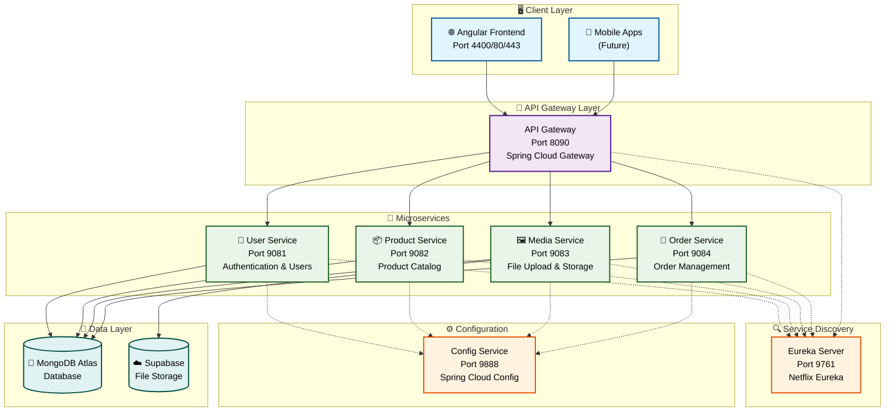

# Buy-01 E-Commerce Platform

<p align="center">
  
  
  
  
  
  
  
  
</p>

<p align="center">
  
  
  
  
</p>

A modern, full-stack e-commerce application built with **Spring Boot** microservices backend and **Angular** frontend, featuring a complete microservices architecture with service discovery, configuration management, and API gateway.

## 🏗️ Architecture Overview

<p align="center">
  
  
  
</p>


```mermaid
flowchart TB
    subgraph Client ["🖥️ Client Layer"]
        WEB["🌐 Angular Frontend<br/>Port 4400/80/443"]
        MOBILE["📱 Mobile Apps<br/>(Future)"]
    end
    
    subgraph Gateway ["🚪 API Gateway Layer"]
        APIGATE["API Gateway<br/>Port 8090<br/>Spring Cloud Gateway"]
    end
    
    subgraph Discovery ["🔍 Service Discovery"]
        EUREKA["Eureka Server<br/>Port 9761<br/>Netflix Eureka"]
    end
    
    subgraph Config ["⚙️ Configuration"]
        CONFIGSVC["Config Service<br/>Port 9888<br/>Spring Cloud Config"]
    end
    
    subgraph Services ["🔧 Microservices"]
        USER["👤 User Service<br/>Port 9081<br/>Authentication & Users"]
        PRODUCT["📦 Product Service<br/>Port 9082<br/>Product Catalog"]
        MEDIA["🖼️ Media Service<br/>Port 9083<br/>File Upload & Storage"]
        ORDER["🛒 Order Service<br/>Port 9084<br/>Order Management"]
    end
    
    subgraph Data ["💾 Data Layer"]
        MONGO[("🍃 MongoDB Atlas<br/>Database")]
        SUPABASE[("☁️ Supabase<br/>File Storage")]
    end
    
    WEB --> APIGATE
    MOBILE --> APIGATE
    APIGATE --> USER
    APIGATE --> PRODUCT
    APIGATE --> MEDIA
    APIGATE --> ORDER
    
    USER -.-> EUREKA
    PRODUCT -.-> EUREKA
    MEDIA -.-> EUREKA
    ORDER -.-> EUREKA
    APIGATE -.-> EUREKA
    
    USER -.-> CONFIGSVC
    PRODUCT -.-> CONFIGSVC
    MEDIA -.-> CONFIGSVC
    ORDER -.-> CONFIGSVC
    
    USER --> MONGO
    PRODUCT --> MONGO
    MEDIA --> MONGO
    ORDER --> MONGO
    MEDIA --> SUPABASE
    
    classDef clientStyle fill:#e1f5fe,stroke:#01579b,stroke-width:2px,color:black
    classDef gatewayStyle fill:#f3e5f5,stroke:#4a148c,stroke-width:2px,color:black
    classDef serviceStyle fill:#e8f5e8,stroke:#1b5e20,stroke-width:2px,color:black
    classDef dataStyle fill:#e0f2f1,stroke:#004d40,stroke-width:2px,color:black
    classDef configStyle fill:#fff3e0,stroke:#e65100,stroke-width:2px,color:black
    
    class WEB,MOBILE clientStyle
    class APIGATE gatewayStyle
    class USER,PRODUCT,MEDIA,ORDER serviceStyle
    class MONGO,SUPABASE dataStyle
    class EUREKA,CONFIGSVC configStyle
```

This project implements a microservices architecture with the following components:

### Backend Services
- **API Gateway** (Port 8090) - Entry point for all client requests
- **Config Service** (Port 9888) - Centralized configuration management
- **Discovery Service** (Port 9761) - Eureka service registry
- **User Service** (Port 9081) - User authentication and management
- **Product Service** (Port 9082) - Product catalog management
- **Media Service** (Port 9083) - File upload and media handling
- **Order Service** (Port 9084) - Order processing and management

### Frontend
- **Angular Frontend** (Port 4400/80/443) - Modern web interface

### Infrastructure
- **MongoDB Atlas** - Database for all services
- **Supabase** - Media file storage
- **Docker** - Containerization
- **Jenkins** - CI/CD pipeline (Integrated with Nexus Repository)

## 🚀 Features

### User Management
- User registration and authentication
- JWT-based security
- Role-based access control (CLIENT/SELLER)
- Profile management with avatar upload

### Product Management
- Product creation, updating, and deletion
- Multi-image upload support
- Product categorization
- Inventory management

### Media Handling
- Image upload and storage
- File validation and processing
- Cloud storage integration

## 🖼️ Media Service & File Uploads

The **media-service** handles all file uploads (such as product images and avatars) and stores them in **Supabase Storage**. Files are uploaded via the API Gateway and stored under a sanitized, unique key to ensure compatibility with Supabase and avoid collisions.

### Upload Flow

1. Client calls the media upload endpoint:
   - `POST /api/media` with `multipart/form-data` containing the file.
2. The request is routed through the API Gateway to `media-service`.
3. `media-service`:
   - Generates a **unique identifier** using `UUID.randomUUID()`.
   - **Sanitizes** the original filename.
   - Uploads the file bytes to Supabase via HTTP.
4. On success, the service returns a **public Supabase URL** for the stored file.

### Supabase Configuration

The media-service uses the following configuration properties (typically provided via environment variables or config-service):

- `supabase.project-url` – Base URL of your Supabase project, e.g. `https://<project-id>.supabase.co`
- `supabase.api-key` – Service role or anon key with permission to upload to storage
- `supabase.bucket-name` – Target storage bucket name (e.g. `media`)

Example (environment variables for Docker):

```bash
SUPABASE_PROJECT_URL=https://<project-id>.supabase.co
SUPABASE_API_KEY=<your-api-key>
SUPABASE_BUCKET_NAME=media
```

### Filename Sanitization Logic

To avoid errors with Supabase Storage keys and to keep URLs safe, uploaded filenames are **sanitized** in `CloudStorageServiceImpl`:

1. **Split name and extension**
   - The last `.` in the original filename is treated as the extension separator.
   - Example: `"my cool image.png"` → base name `"my cool image"`, extension `".png"`.

2. **Remove disallowed characters**
   - Only these characters are kept in the base name: `a–z`, `A–Z`, `0–9`, `.`, `_`, `-`.
   - All other characters (including emojis, spaces, accents, and most punctuation) are removed.

3. **Normalize separators**
   - Runs of `.`, `_`, and `-` are collapsed into a single `_`.
   - Leading/trailing separators are removed.
   - Examples:
     - `"my---file__name.."` → `"my_file_name"`
     - `"___file"` → `"file"`

4. **Ensure non-empty name**
   - If the sanitized base name becomes empty (e.g. filename was only emojis or symbols), it falls back to `"file"`.

5. **Limit length**
   - The base name is truncated to **50 characters** to keep keys short and robust.

6. **Prefix with UUID**
   - The final stored key is: `<uuid>_<sanitizedBaseName><extension>`
   - Example output: `"550e8400-e29b-41d4-a716-446655440000_my_file.png"`

### Error Handling

- If the incoming file has **no content type**, the upload is rejected with an error.
- If Supabase responds with a **non-2xx status**, the service throws a runtime exception to signal upload failure.

### Public URL Format

On success, the service returns a public URL like:

```text
{supabase.project-url}/storage/v1/object/public/{supabase.bucket-name}/{uuid}_{sanitizedBaseName}{extension}
```

You can store this URL in product or user documents (via product-service or user-service) and use it directly in the frontend for image rendering.

## 🛠️ Technology Stack

### Backend
<p align="left">
  
  
  
  
  
  
  
</p>

- **Spring Boot 3.5.6** - Main framework
- **Spring Security** - Authentication & authorization
- **Spring Cloud Config** - Configuration management
- **Spring Cloud Gateway** - API routing
- **Netflix Eureka** - Service discovery
- **MongoDB** - Database
- **JWT** - Token-based authentication
- **Maven** - Build tool

### Frontend
<p align="left">
  
  
  
  
  
</p>

- **Angular 20+** - Frontend framework
- **TypeScript** - Programming language
- **CSS3 (Custom Design System)** - Styling
- **RxJS** - Reactive programming

### DevOps & Infrastructure
<p align="left">
  
  
  
  
  
  
  
</p>

- **Docker & Docker Compose** - Containerization
- **Jenkins** - CI/CD pipeline with automatic rollback
- **SonarQube** - Code quality and security analysis
- **Nginx** - Reverse proxy (frontend)
- **MongoDB Atlas** - Cloud database
- **Supabase** - File storage

## 📋 Prerequisites

- **Java 21** or later
- **Node.js 18+** and npm
- **Docker & Docker Compose**
- **Maven 3.9+**
- **MongoDB Atlas** account
- **Supabase** account (for file storage)

## 🚀 Quick Start

### 1. Clone the Repository
```bash
git clone <repository-url>
cd buy-01
```

### 2. Environment Setup
Set up the following environment variables or update configuration files:
```bash
export CONFIG_REPO_URI=https://github.com/TanakAiko/config-buy-01.git
export CONFIG_REPO_USERNAME=your-username
export CONFIG_REPO_PASSWORD=your-password
```

### 3. Build and Run with Docker Compose
```bash
# Build all services
docker compose build

# Start all services
docker compose up -d

# Check service status
docker compose ps
```

### 4. Access the Application
- **Frontend**: http://localhost:4400 or https://localhost:8444
- **API Gateway**: http://localhost:8090
- **Eureka Dashboard**: http://localhost:9761
- **Config Service**: http://localhost:9888

## 🔧 Development Setup

### Backend Services
```bash
# Build all backend services
mvn clean package -DskipTests

# Run individual service (example: user-service)
cd user-service
mvn spring-boot:run
```

### Frontend Development
```bash
cd buy-01-frontend
npm install
npm start
```

## 🧪 Testing

### Run All Tests
```bash
# Backend tests
mvn test

# Frontend tests
cd buy-01-frontend
npm test
```

### Run Tests in CI Mode
```bash
cd buy-01-frontend
npm run test:ci
```

## 📚 API Documentation

The API follows RESTful principles. Key endpoints include:

### Authentication
- `POST /api/users/login` - User login
- `POST /api/users` - User registration

### Products
- `GET /api/products` - List all products
- `POST /api/products` - Create product (authenticated)
- `GET /api/products/{id}` - Get product details
- `PUT /api/products/{id}` - Update product (authenticated)
- `DELETE /api/products/{id}` - Delete product (authenticated)

### Media
- `POST /api/media` - Upload media file
- `GET /api/media/product/{productId}` - Get product media
- `DELETE /api/media/{id}` - Delete media file

### Users
- `GET /api/users/custom` - List users (authenticated)
- `GET /api/users/{userID}/custom` - Get user details (authenticated)

## 🏃‍♂️ CI/CD Pipeline

The project includes a comprehensive Jenkins pipeline with automatic rollback and code quality analysis:

1. **Load Rollback Info** - Load previous successful build reference
2. **Test** all services in parallel (Maven + npm)
3. **SonarQube Analysis** - Code quality and security scanning
4. **Quality Gate Check** - Verify code meets quality standards
5. **Build Docker Images** - Build all microservices and frontend
6. **Push** images to Nexus Repository with version tags
7. **Deploy** the complete stack using Docker Compose
8. **Save Build Reference** - Store successful build tag for rollback
9. **Automatic Rollback** - Roll back to last successful version on failure
10. **Email Notifications** - Send detailed status reports

### Pipeline Stages
- **Stage 0**: Load rollback information
- **Stage 1**: Parallel testing (Maven + npm)
- **Stage 2**: SonarQube analysis & Quality Gate validation
- **Stage 3**: Docker image building
- **Stage 4**: Image pushing to Nexus Repository
- **Stage 5**: Application deployment
- **Stage 6**: Save build reference for future rollback

### Code Quality & Security
The pipeline includes **SonarQube** integration for continuous code quality monitoring:
- 📊 **Code Coverage**: Track test coverage across all services
- 🐛 **Bug Detection**: Identify potential bugs and code issues
- 🔒 **Security Analysis**: Detect vulnerabilities and security hotspots
- 📈 **Code Smells**: Identify maintainability issues
- 🚦 **Quality Gates**: Enforce quality standards on every build

**Setup Guide**: See [SONARQUBE_SETUP.md](./SONARQUBE_SETUP.md) for SonarQube configuration instructions.

### Automatic Rollback
The pipeline features automatic rollback on deployment failure:
- 💾 **Build Tracking**: Saves successful build tags automatically
- 🔄 **Smart Rollback**: Rolls back to last known good version on failure
- 🛡️ **Zero Downtime**: Ensures service continuity during rollback
- 📝 **Detailed Logging**: Complete audit trail of all deployments

**Rollback Guide**: See [ROLLBACK_GUIDE.md](./ROLLBACK_GUIDE.md) for rollback documentation.

### Artifact Management (Nexus)
The project relies on **Nexus Repository Manager** for secure artifact storage and dependency proxying:
- 📦 **Docker Registry**: Private registry for all microservice images.
- ☕ **Maven Proxy**: Caches and serves Java dependencies.

**Setup Guide**: See [NEXUS_SETUP.md](./NEXUS_SETUP.md) for repository configuration and local setup.

### Email Notifications
The pipeline automatically sends professional HTML email notifications:
- ✅ **Success**: When build completes successfully with deployment links
- ❌ **Failure**: When build fails with troubleshooting steps and automatic rollback status
- ⚠️ **Unstable**: When build has warnings or test failures

**Setup Guide**: See [JENKINS_EMAIL_SETUP.md](./JENKINS_EMAIL_SETUP.md) for detailed configuration instructions.

## 🔐 Security

- JWT-based authentication
- Role-based authorization (CLIENT/SELLER)
- HTTPS support with SSL certificates
- Input validation and sanitization
- Secure file upload handling

## 📱 User Roles

### CLIENT
- Browse products
- View product details
- Manage profile

### SELLER
- All CLIENT permissions
- Create/update/delete products
- Upload product images
- Manage inventory

## 🐳 Docker Services

| Service | Port | Health Check |
|---------|------|--------------|
| eureka-server | 9761 | `/actuator/health` |
| config-service | 9888 | `/actuator/health` |
| api-gateway | 8090 | `/actuator/health` |
| user-service | 9081 | `/actuator/health` |
| product-service | 9082 | `/actuator/health` |
| media-service | 9083 | `/actuator/health` |
| order-service | 9084 | `/actuator/health` |
| frontend | 4400, 8444 | - |

## 🔍 Monitoring & Health Checks

All services expose actuator endpoints for monitoring:
- `/actuator/health` - Service health status
- `/actuator/info` - Service information

## 🚨 Troubleshooting

### Common Issues

1. **MongoDB Connection Issues**
   - Verify MongoDB Atlas credentials
   - Check network connectivity
   - Ensure IP whitelist is configured

2. **Service Discovery Issues**
   - Ensure Eureka server is running
   - Check service registration in Eureka dashboard

3. **Configuration Issues**
   - Verify config server is accessible
   - Check external configuration repository

### Logs
```bash
# View service logs
docker logs <service-name>

# Follow logs
docker logs -f <service-name>
```

## 🤝 Contributing

1. Fork the repository
2. Create a feature branch (`git checkout -b feature/AmazingFeature`)
3. Commit your changes (`git commit -m 'Add some AmazingFeature'`)
4. Push to the branch (`git push origin feature/AmazingFeature`)
5. Open a Pull Request

## 👥 Authors

- **Cheikh Ahmed Tidiane Cherif MBAYE**

## 🙏 Acknowledgments

- Spring Boot community
- Angular team
- Docker community
- All contributors
