# Buy-01 E-Commerce Platform

<p align="center">
  
  
  
  
</p>
 
<p align="center">
  
  
  
  
</p>

A modern, full-stack e-commerce application built with **Spring Boot** microservices backend and **Angular** frontend, featuring a complete microservices architecture with service discovery, configuration management, and API gateway.

## 🏗️ Architecture Overview

<p align="center">
  
  
  
</p>



```mermaid
flowchart TB
    subgraph Client["🖥️ Client Layer"]
        WEB["🌐 Angular Frontend<br/>Port 4200/80/443"]
        MOBILE["📱 Mobile Apps<br/>(Future)"]
    end
    
    subgraph Gateway["🚪 API Gateway Layer"]
        APIGATE["API Gateway<br/>Port 8090<br/>Spring Cloud Gateway"]
    end
    
    subgraph Discovery["🔍 Service Discovery"]
        EUREKA["Eureka Server<br/>Port 8761<br/>Netflix Eureka"]
    end
    
    subgraph Config["⚙️ Configuration"]
        CONFIGSVC["Config Service<br/>Port 8888<br/>Spring Cloud Config"]
    end
    
    subgraph Services["🔧 Microservices"]
        USER["👤 User Service<br/>Port 8081<br/>Authentication & Users"]
        PRODUCT["📦 Product Service<br/>Port 8082<br/>Product Catalog"]
        MEDIA["🖼️ Media Service<br/>Port 8083<br/>File Upload & Storage"]
    end
    
    subgraph Data["💾 Data Layer"]
        MONGO[("🍃 MongoDB Atlas<br/>Database")]
        SUPABASE[("☁️ Supabase<br/>File Storage")]
    end
    
    WEB --> APIGATE
    MOBILE --> APIGATE
    APIGATE --> USER
    APIGATE --> PRODUCT
    APIGATE --> MEDIA
    
    USER -.-> EUREKA
    PRODUCT -.-> EUREKA
    MEDIA -.-> EUREKA
    APIGATE -.-> EUREKA
    
    USER -.-> CONFIGSVC
    PRODUCT -.-> CONFIGSVC
    MEDIA -.-> CONFIGSVC
    
    USER --> MONGO
    PRODUCT --> MONGO
    MEDIA --> MONGO
    MEDIA --> SUPABASE
    
    classDef clientStyle fill:#e1f5fe,stroke:#01579b,stroke-width:2px
    classDef gatewayStyle fill:#f3e5f5,stroke:#4a148c,stroke-width:2px
    classDef serviceStyle fill:#e8f5e8,stroke:#1b5e20,stroke-width:2px
    classDef dataStyle fill:#e0f2f1,stroke:#004d40,stroke-width:2px
    classDef configStyle fill:#fff3e0,stroke:#e65100,stroke-width:2px
    
    class WEB,MOBILE clientStyle
    class APIGATE gatewayStyle
    class USER,PRODUCT,MEDIA serviceStyle
    class MONGO,SUPABASE dataStyle
    class EUREKA,CONFIGSVC configStyle
```

This project implements a microservices architecture with the following components:

### Backend Services
- **API Gateway** (Port 8090) - Entry point for all client requests
- **Config Service** (Port 8888) - Centralized configuration management
- **Discovery Service** (Port 8761) - Eureka service registry
- **User Service** (Port 8081) - User authentication and management
- **Product Service** (Port 8082) - Product catalog management
- **Media Service** (Port 8083) - File upload and media handling

### Frontend
- **Angular Frontend** (Port 4200/80/443) - Modern web interface

### Infrastructure
- **MongoDB Atlas** - Database for all services
- **Supabase** - Media file storage
- **Docker** - Containerization
- **Jenkins** - CI/CD pipeline

## 🚀 Features

### User Management
- User registration and authentication
- JWT-based security
- Role-based access control (CLIENT/SELLER)
- Profile management with avatar upload

### Product Management
- Product creation, updating, and deletion
- Multi-image upload support
- Product categorization
- Inventory management

### Media Handling
- Image upload and storage
- File validation and processing
- Cloud storage integration

## 🛠️ Technology Stack

### Backend
<p align="left">
  
  
  
  
  
  
  
</p>

- **Spring Boot 3.5.6** - Main framework
- **Spring Security** - Authentication & authorization
- **Spring Cloud Config** - Configuration management
- **Spring Cloud Gateway** - API routing
- **Netflix Eureka** - Service discovery
- **MongoDB** - Database
- **JWT** - Token-based authentication
- **Maven** - Build tool

### Frontend
<p align="left">
  
  
  
  
  
  
</p>

- **Angular 18+** - Frontend framework
- **TypeScript** - Programming language
- **Bootstrap/CSS3** - Styling
- **RxJS** - Reactive programming

### DevOps & Infrastructure
<p align="left">
  
  
  
  
  
  
</p>

- **Docker & Docker Compose** - Containerization
- **Jenkins** - CI/CD pipeline
- **Nginx** - Reverse proxy (frontend)
- **MongoDB Atlas** - Cloud database
- **Supabase** - File storage

## 📋 Prerequisites

- **Java 21** or later
- **Node.js 18+** and npm
- **Docker & Docker Compose**
- **Maven 3.9+**
- **MongoDB Atlas** account
- **Supabase** account (for file storage)

## 🚀 Quick Start

### 1. Clone the Repository
```bash
git clone <repository-url>
cd buy-01
```

### 2. Environment Setup
Set up the following environment variables or update configuration files:
```bash
export CONFIG_REPO_URI=https://github.com/mamadbah2/config-buy-01.git
export CONFIG_REPO_USERNAME=your-username
export CONFIG_REPO_PASSWORD=your-password
```

### 3. Build and Run with Docker Compose
```bash
# Build all services
docker-compose build

# Start all services
docker-compose up -d

# Check service status
docker-compose ps
```

### 4. Access the Application
- **Frontend**: http://localhost:4200 or https://localhost:8443
- **API Gateway**: http://localhost:8090
- **Eureka Dashboard**: http://localhost:8761
- **Config Service**: http://localhost:8888

## 🔧 Development Setup

### Backend Services
```bash
# Build all backend services
mvn clean package -DskipTests

# Run individual service (example: user-service)
cd user-service
mvn spring-boot:run
```

### Frontend Development
```bash
cd buy-01-frontend
npm install
npm start
```

## 🧪 Testing

### Run All Tests
```bash
# Backend tests
mvn test

# Frontend tests
cd buy-01-frontend
npm test
```

### Run Tests in CI Mode
```bash
cd buy-01-frontend
npm run test:ci
```

## 📚 API Documentation

The API follows RESTful principles. Key endpoints include:

### Authentication
- `POST /api/users/login` - User login
- `POST /api/users` - User registration

### Products
- `GET /api/products` - List all products
- `POST /api/products` - Create product (authenticated)
- `GET /api/products/{id}` - Get product details
- `PUT /api/products/{id}` - Update product (authenticated)
- `DELETE /api/products/{id}` - Delete product (authenticated)

### Media
- `POST /api/media` - Upload media file
- `GET /api/media/product/{productId}` - Get product media
- `DELETE /api/media/{id}` - Delete media file

### Users
- `GET /api/users/custom` - List users (authenticated)
- `GET /api/users/{userID}/custom` - Get user details (authenticated)

## 🏃‍♂️ CI/CD Pipeline

The project includes a comprehensive Jenkins pipeline that:

1. **Tests** all services in parallel
2. **Builds** Docker images
3. **Pushes** images to Docker Hub
4. **Deploys** the complete stack

### Pipeline Stages
- Source code testing (Maven + npm)
- Docker image building
- Image pushing to registry
- Application deployment

## 🔐 Security

- JWT-based authentication
- Role-based authorization (CLIENT/SELLER)
- HTTPS support with SSL certificates
- Input validation and sanitization
- Secure file upload handling

## 📱 User Roles

### CLIENT
- Browse products
- View product details
- Manage profile

### SELLER
- All CLIENT permissions
- Create/update/delete products
- Upload product images
- Manage inventory

## 🐳 Docker Services

| Service | Port | Health Check |
|---------|------|--------------|
| eureka-server | 8761 | `/actuator/health` |
| config-service | 8888 | `/actuator/health` |
| api-gateway | 8090 | `/actuator/health` |
| user-service | 8081 | `/actuator/health` |
| product-service | 8082 | `/actuator/health` |
| media-service | 8083 | `/actuator/health` |
| frontend | 80, 443 | - |

## 🔍 Monitoring & Health Checks

All services expose actuator endpoints for monitoring:
- `/actuator/health` - Service health status
- `/actuator/info` - Service information

## 🚨 Troubleshooting

### Common Issues

1. **MongoDB Connection Issues**
   - Verify MongoDB Atlas credentials
   - Check network connectivity
   - Ensure IP whitelist is configured

2. **Service Discovery Issues**
   - Ensure Eureka server is running
   - Check service registration in Eureka dashboard

3. **Configuration Issues**
   - Verify config server is accessible
   - Check external configuration repository

### Logs
```bash
# View service logs
docker logs <service-name>

# Follow logs
docker logs -f <service-name>
```

## 🤝 Contributing

1. Fork the repository
2. Create a feature branch (`git checkout -b feature/AmazingFeature`)
3. Commit your changes (`git commit -m 'Add some AmazingFeature'`)
4. Push to the branch (`git push origin feature/AmazingFeature`)
5. Open a Pull Request

## 👥 Authors

- **Cheikh Ahmed Tidiane Cherif MBAYE**

## 🙏 Acknowledgments

- Spring Boot community
- Angular team
- Docker community
- All contributors
